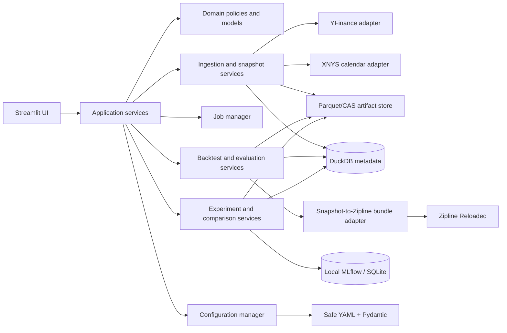
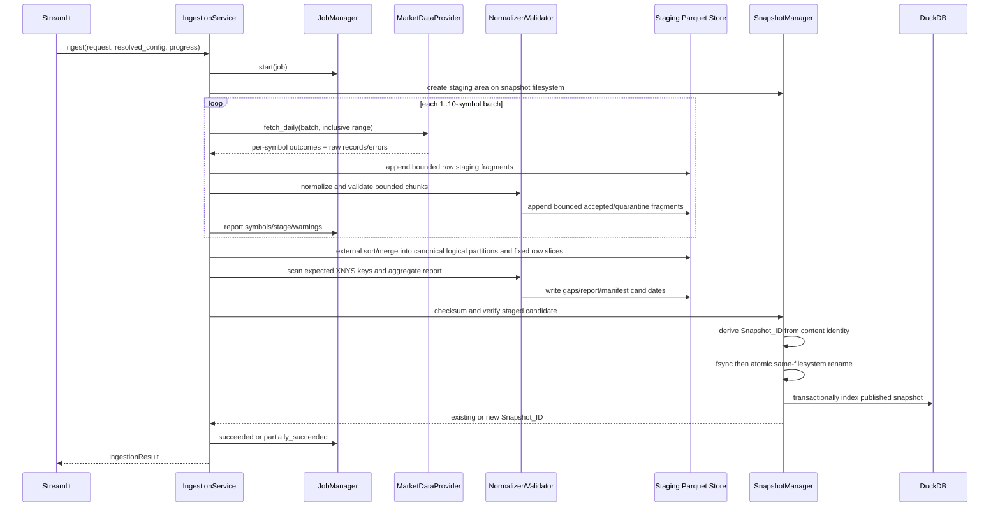
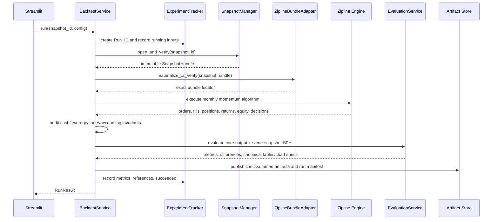

# Design Document: Quantitative Research Platform — Phase 1 Vertical Slice

## Overview

This design implements only the approved first usable Phase 1 vertical slice: a local, single-developer research loop that resolves validated configuration, ingests free daily US-equity data from yfinance, publishes immutable data snapshots, runs one monthly long-only momentum strategy with Zipline Reloaded, evaluates it against SPY, records immutable local experiments with MLflow, compares prior runs, and exposes the workflow through Streamlit.

The design is a modular monolith. Framework-independent application services own all use cases; Streamlit is an adapter, not the application core. DuckDB indexes metadata, partitioned Parquet stores tabular data, a content-addressed local artifact store preserves immutable objects, and MLflow provides local experiment cataloging. Everything executes synchronously in one local process. There is no FastAPI service, distributed queue, LLM capability, broker adapter, paper trading, or live execution in this slice.

### Design priorities

Decisions follow the constitution's order: correctness, maintainability, simplicity, extensibility, reproducibility, developer productivity, then performance. In particular:

1. **Scientific identity is separated from operational history.** Retrieval times, job IDs, run IDs, paths, and progress timestamps remain inspectable but do not affect content-derived identities.
2. **Published data and terminal runs are append-only through platform APIs.** Corrections produce new snapshots or runs.
3. **No missing bar is synthesized.** Missing expected NYSE sessions become explicit gaps; invalid observations become quarantine records.
4. **Adjustment semantics are platform-owned and causal.** The platform derives a causal research-adjusted OHLCV series and canonical corporate-action rows. The derived Zipline bundle receives raw bars plus that action stream exactly once, so Zipline can maintain actual-share positions without double adjustment.
5. **External libraries are used at clear boundaries.** yfinance acquires data, `exchange_calendars` supplies XNYS sessions, Zipline Reloaded supplies the event-driven backtest engine and ledger, MLflow catalogs experiments, DuckDB queries local analytical data, and PyArrow writes deterministic Parquet.
6. **Resource use is bounded.** Provider calls are batched, normalization/writes are chunked, validation aggregates partition-by-partition, backtests project only needed columns and sessions, and Streamlit tables are paginated.

### Approved defaults and fixed constraints

| Concern | Decision |
|---|---|
| Runtime | Python `>=3.11,<3.12` |
| Universe | Ordered, normalized, duplicate-free 1–25 symbols; default `AAPL,JPM,MSFT,PG,XOM` |
| Benchmark | SPY, separate from strategy candidates unless explicitly included |
| Provider batch | 1–10 symbols; default 5 |
| Comparison | 2–10 successful runs |
| Storage | DuckDB metadata plus partitioned Parquet and local content-addressed artifacts |
| Experiment tracking | Local MLflow with SQLite backend and local artifact references |
| Initial equity | USD 100,000, fixed |
| Costs | 5 bps commission and 10 bps adverse slippage by default |
| Execution | Whole-share orders; next XNYS session adjusted open; sells before buys |
| Portfolio constraints | Long-only, no leverage, non-negative cash, zero cash return |
| Calendar | Pinned `exchange_calendars` XNYS implementation and schedule digest |
| UI | Streamlit over application services; synchronous jobs |

### Research findings informing the design

- The [yfinance download API](https://ranaroussi.github.io/yfinance/reference/api/yfinance.download.html) documents that `start` is inclusive, `end` is exclusive, `auto_adjust=True` mutates OHLC, and actions are opt-in. The adapter therefore requests `end + 1 calendar day`, sets `auto_adjust=False`, `actions=True`, `repair=False`, and preserves both raw provider values and `Adj Close`; the platform, rather than yfinance, owns the declared adjustment algorithm.
- The [Zipline data-bundle documentation](https://zipline.ml4trading.io/bundles.html) defines custom ingestion through asset, daily-bar, and adjustment writers; it also permits a bundle ingest function to read existing local files and accepts lazy daily-bar iterables. The platform therefore creates a disposable, snapshot-keyed Zipline bundle from verified platform Parquet, supplies raw bars and the platform's canonical actions exactly once, and never lets Zipline download or own source data.
- The [MLflow local-database guidance](https://mlflow.org/docs/latest/ml/tracking/tutorials/local-database/) recommends a local SQLite tracking URI for a solo local workflow. MLflow's database is used for experiment cataloging while DuckDB remains the platform's query/index store and the platform artifact store remains authoritative.
- Python documents that a successful same-filesystem [`os.replace`/rename operation is atomic](https://docs.python.org/3.11/library/os.html#os.replace). Staging and final snapshot directories are therefore required to share one filesystem; files and directories are synchronized before one atomic directory rename. DuckDB reconciliation handles the unavoidable lack of a transaction spanning the filesystem and database.
- DuckDB's Parquet integration is used for partition and column pruning; the design relies on filtered Parquet scans rather than loading complete datasets into pandas.

Content was rephrased for compliance with licensing restrictions.

## Architecture

### Architectural style and boundaries

The system is a ports-and-adapters modular monolith with four layers:

1. **Domain** — immutable value objects and pure policies: configuration values, sessions, bars, actions, validation decisions, momentum decisions, execution arithmetic, metrics, manifests, checksums, and errors.
2. **Application** — synchronous use-case coordinators: configure, ingest, snapshot, run backtest, evaluate, track experiment, compare runs, inspect artifacts, and paginate tables.
3. **Infrastructure** — yfinance, exchange calendars, DuckDB, PyArrow/Parquet, filesystem, Zipline Reloaded, MLflow, Git/environment fingerprinting, and structured logs.
4. **Presentation** — Streamlit pages and presenters. Presentation may import application DTOs but never infrastructure implementations.

Dependency direction is inward: `presentation -> application -> domain`; infrastructure implements ports declared in domain/application and is wired only in a composition root. Domain code imports no Streamlit, MLflow, DuckDB, yfinance, PyArrow, or Zipline modules. Application services do not read Streamlit session state.



### Proposed package responsibilities

The names describe task-sized implementation units; they are not speculative plugin frameworks.

```text
src/quant_research_platform/
  domain/
    errors.py            ActionableError, warning and reason-code taxonomy
    canonical.py         canonical JSON/YAML/table rules and SHA-256 helpers
    market.py            sessions, raw records, bars, actions, gaps
    manifests.py         snapshot/run content and operational manifests
    strategy.py          momentum decisions and rational target weights
    execution.py         whole-share order sizing, fill/cost arithmetic, invariants
    evaluation.py        deterministic metric functions
  config/
    models.py            Pydantic settings decomposition and cross-field rules
    loader.py            safe YAML, duplicate/unknown-key detection, precedence
    serializer.py        canonical redacted YAML
    project_root.py      exactly-one pyproject.toml boundary resolution
  application/
    services.py          public facade and request/result DTOs
    ingestion.py         staged ingestion orchestration
    backtests.py         run lifecycle, snapshot pinning, Zipline execution
    comparisons.py       run discovery and aligned comparisons
    jobs.py              synchronous progress/state transitions
    inspection.py        manifests, artifacts, pagination
  infrastructure/
    yfinance_provider.py narrow provider adapter and retry classification
    xnys_calendar.py     pinned session mapping and schedule digest
    parquet_store.py     chunked deterministic writes and filtered reads
    duckdb_metadata.py   metadata repositories and transactions
    filesystem_store.py  staging, CAS, fsync, publish and reconcile
    zipline_bundle.py    verified snapshot-to-bundle materialization
    zipline_engine.py    algorithm/blotter boundary and output extraction
    mlflow_tracker.py    local MLflow lifecycle and artifact references
    fingerprint.py       environment/source fingerprint
    logging.py           structured sanitized local logging
  ui/
    app.py               composition and navigation
    pages/               configure, ingest, snapshots, backtest, runs, compare
    presenters.py        redacted DTO-to-view formatting
```

There is one composition root in `ui/app.py` (and a small test composition root). It creates concrete adapters and injects them into application services. No service locator or general plugin registry is needed in this slice.

### End-to-end flows

#### Configuration and Streamlit interaction

1. Streamlit loads the selected YAML mapping into an editable form. Submitted non-secret form values become the effective in-memory `YAML_Document` for that resolution; they do not create a fourth precedence tier. Explicitly mapped environment values still override the effective YAML document.
2. `ConfigurationManager.resolve()` locates the project root, safe-loads YAML, rejects duplicate and unknown keys, merges defaults/YAML/explicitly mapped environment values, validates the complete Pydantic model, normalizes paths, and returns a frozen `ResolvedConfig` plus field-level provenance.
3. UI actions remain disabled until resolution succeeds. Only `NonSecretConfig` crosses the presenter boundary.
4. Clicking an action invokes one synchronous application service. A progress callback updates a persisted job row and Streamlit status container. Refreshing the page reads the latest persisted job state; it does not resume a killed process.
5. Tables query one page through DuckDB. Full artifact downloads stream the existing file and never materialize the full table in an ordinary view.

#### Ingestion, validation, and snapshot publication



Incremental ingestion first verifies the parent snapshot and requires the new requested start to equal the parent's requested start and the new end not to precede the parent end; shrinking or back-extending a range is a full-ingestion request, not an incremental update. It computes the first of the latest `revision_overlap` parent XNYS sessions (or the first strictly later session when overlap is zero) and requests the single contiguous suffix from that boundary through the new requested end. Thus an unchanged range rechecks only the overlap, and an extended range rechecks overlap plus all later sessions.

For each symbol, causal normalization seeds the suffix with the verified parent state immediately before the request boundary: prior raw close, cumulative split factor, and cumulative price factor. The service then recomputes every row from the boundary through the requested end, so a revised overlap action propagates through the full affected suffix. Parent objects wholly before the boundary are referenced unchanged; final suffix objects are rebuilt from canonical logical partitions, not patched in place. A failed symbol retains all verified parent content when available and records retained coverage; it contributes no new content otherwise. The merged logical table is revalidated. If resulting scientific content and policy inputs equal an existing snapshot, staging is discarded and that existing ID is returned; the update operation records its attempted parent separately without rewriting the existing manifest.

#### Snapshot-to-backtest, evaluation, and experiment flow



A `Run_ID` is created before snapshot verification or execution so every failure is discoverable. Scientific outputs are written to staging and promoted to the content-addressed artifact store before terminal state is recorded. If execution or evaluation fails, available diagnostics are attached and the run becomes terminal `failed`; a failed run is never converted to succeeded in place.

#### Run discovery and comparison

1. DuckDB filters runs by operational run ID/time/state and scientific snapshot/strategy/universe/evaluation fields.
2. `ComparisonService` accepts an ordered 2–10 list, rejects non-successful or duplicate run IDs, verifies every manifest and required artifact, and loads only metric rows and filtered equity columns.
3. It displays original ranges and computes the intersection of available XNYS sessions for curve display. It does not silently recompute or replace each run's original metrics.
4. Snapshot, non-secret configuration, and environment differences are produced as deterministic field-path/value tables before metric rows.
5. The comparison artifact is a checksummed canonical JSON/Parquet view containing selected run IDs as operational references and selected run scientific manifest checksums as identity inputs.

### Storage ownership and local consistency model

The platform owns source data, normalized data, manifests, and canonical run artifacts. Zipline bundle files and Streamlit caches are derived caches and may be deleted/rebuilt. MLflow catalogs a run and references authoritative checksums; it is not the only copy of scientific artifacts.

All roots participating in one publication (`staging`, `objects`, `snapshots`, or `runs`) must resolve to the same filesystem device. On local macOS/APFS:

1. create `.<operation-id>.staging` beneath the store root;
2. write candidate object files with exclusive creation, flush, `fsync` files, and `fsync` their staging directories;
3. checksum the staged objects, derive the content identity/ID, and promote each immutable object to its content-addressed final path with a same-filesystem rename; an already existing object is reused only after byte verification;
4. create and `fsync` a small publication directory containing the final manifest and operational metadata, then verify every final object named by the manifest;
5. atomically rename that complete publication directory to the absent `snapshots/<snapshot-id>` (or run-publication) directory;
6. `fsync` the final parent directory;
7. commit the DuckDB index transaction.

Promoted CAS objects are not snapshot-visible by themselves: readers resolve content only through a published manifest. A crash before step 5 may therefore leave harmless unreferenced CAS objects, which reconciliation can retain for deduplication or garbage-collect when no staging/manifest references them. No filesystem/database distributed transaction is claimed. A crash between steps 5 and 7 leaves a complete but unindexed publication directory. Startup reconciliation verifies and indexes it. A database row whose directory is absent or invalid is marked unavailable and never opened. If the final Snapshot ID directory already exists, the manager verifies equality of canonical `content_identity` and every referenced object, reuses the existing immutable manifest, and records the new operation's lineage/times separately; differences only in excluded lineage/operational fields are not corruption. Any scientific identity/reference mismatch at the same ID is a corruption error. Readers never resolve staging paths.

Only one publishing process is supported. A store-level advisory lock prevents concurrent writers; read-only inspection remains available. This matches the synchronous, one-developer scope and avoids inventing distributed coordination.

## Components and Interfaces

### Public application facade

Streamlit and tests use one facade whose methods return typed results and never leak infrastructure exceptions.

```python
from collections.abc import Callable, Sequence
from pathlib import Path
from typing import Protocol

ProgressCallback = Callable[["ProgressUpdate"], None]

class ResearchApplication(Protocol):
    def resolve_configuration(
        self, yaml_path: Path | None, *, ui_yaml_values: dict[str, object] | None = None
    ) -> "Result[ConfigurationResolution]": ...

    def ingest(
        self, request: "IngestionRequest", config: "ConfigurationHandle",
        *, progress: ProgressCallback | None = None
    ) -> "Result[IngestionResult]": ...

    def list_snapshots(self, query: "SnapshotQuery") -> "Page[SnapshotSummary]": ...
    def inspect_snapshot(self, snapshot_id: str) -> "Result[SnapshotDetail]": ...

    def run_backtest(
        self, request: "BacktestRequest", config: "ConfigurationHandle",
        *, progress: ProgressCallback | None = None
    ) -> "Result[RunResult]": ...

    def search_runs(self, query: "RunQuery") -> "Page[RunSummary]": ...
    def inspect_run(self, run_id: str) -> "Result[RunDetail]": ...
    def compare_runs(self, run_ids: Sequence[str]) -> "Result[ComparisonResult]": ...
    def page_artifact(self, checksum: str, page: int, page_size: int) -> "Result[TablePage]": ...
    def open_artifact(self, checksum: str) -> "Result[VerifiedArtifact]": ...
```

`Result[T]` is either `Ok[T]` or `Err[tuple[ActionableError, ...]]`; expected validation/provider/storage failures are values, not exception control flow. Unexpected exceptions are caught once at an application boundary, sanitized, logged with a correlation ID, and returned as one actionable internal error.

`ConfigurationResolution` contains a redacted `ResolvedConfigView` plus an opaque in-process `ConfigurationHandle`. The facade privately associates that unforgeable handle with the frozen full `ResolvedConfig`; Streamlit may retain the handle in session state but cannot inspect or serialize secret values. Ingestion/backtest reject an unknown or stale handle, and a process restart requires re-resolution. This keeps the validated object used by an operation identical to the validated preview without sending secrets through presenter DTOs.

The operation requests stay small because scientific parameters come from the configuration referenced by that handle:

```python
@dataclass(frozen=True)
class ConfigurationHandle:
    _token: UUID

@dataclass(frozen=True)
class ConfigurationResolution:
    handle: ConfigurationHandle
    view: ResolvedConfigView

@dataclass(frozen=True)
class IngestionRequest:
    parent_snapshot_id: str | None = None   # None means full ingestion

@dataclass(frozen=True)
class BacktestRequest:
    snapshot_id: str
    # evaluation range is config.data.requested_range and must be covered

@dataclass(frozen=True)
class RunQuery:
    run_id: str | None = None
    snapshot_id: str | None = None
    strategy_id: str | None = None
    universe: tuple[str, ...] | None = None
    evaluation_start: date | None = None
    evaluation_end: date | None = None
    state: str | None = None
    created_from: datetime | None = None
    created_to: datetime | None = None
    page: int = 0
    page_size: int = 100
```

A backtest verifies that its configured evaluation range lies within the snapshot's requested/covered range. It reads earlier rows from that same snapshot only when needed for the 253-session warm-up; it does not move the reported evaluation start or use another snapshot.

### Configuration manager

Configuration uses frozen Pydantic v2 models with `extra="forbid"`. Model field order is the canonical human-readable YAML order. `ruamel.yaml` safe mode with duplicate keys disabled parses YAML; tags and arbitrary object construction are not permitted.

```python
class ConfigurationManager(Protocol):
    def resolve(
        self,
        yaml_document: bytes | None,
        environment: Mapping[str, str],
    ) -> Result[ResolvedConfig]: ...

    def non_secret(self, config: ResolvedConfig) -> NonSecretConfig: ...
    def canonical_yaml(self, config: ResolvedConfig | NonSecretConfig) -> bytes: ...
    def redact_text(self, text: str, config: ResolvedConfig) -> str: ...
```

Merge is leaf-wise in the approved order: documented defaults, then the effective YAML document, then the allowlisted environment map. The Streamlit adapter may construct the effective YAML document from an edited form, but it does so before calling `ConfigurationManager` and never overrides an environment value. The UI displays field provenance; durable reproducibility records the fully resolved configuration. The required environment allowlist is explicit, for example `QRP_DATA__BATCH_SIZE -> data.batch_size` and `QRP_SECRETS__HTTPS_PROXY -> secrets.https_proxy`. Any `QRP_` variable not in the map is rejected.

Project-root resolution walks from the installed package/entry path upward, requires exactly one selected ancestor containing the package's `pyproject.toml`, and rejects ambiguous nested project boundaries. Relative paths are normalized with `resolve(strict=False)` and checked with `Path.is_relative_to(project_root)` before directories are created. Absolute paths are allowed as approved.

Validation errors are sorted by Pydantic schema field order, then list index. Secret values are collected before any parse/validation message is formatted, and exact occurrences are replaced with `[REDACTED]`. Redaction is idempotent. Canonical YAML emits all non-secret fields, UTF-8, LF endings, one terminal LF, schema order, lowercase booleans/nulls, ISO dates, decimal strings for monetary/basis-point values, and `[REDACTED]` as the entire value for a present secret. Reloading that marker yields an unresolved secret, never the literal credential.

### Market-data provider and yfinance adapter

```python
@dataclass(frozen=True)
class ProviderRequest:
    symbols: tuple[str, ...]          # 1..10, normalized and distinct
    start: date                       # inclusive
    end: date                         # inclusive

class MarketDataProvider(Protocol):
    @property
    def name(self) -> str: ...

    def fetch_daily(
        self, request: ProviderRequest, retry: RetryPolicy
    ) -> ProviderBatchResult: ...
```

`ProviderBatchResult` contains one `SymbolOutcome` per requested symbol, even when yfinance returns a combined frame. Each outcome is success with ordered `ProviderRecord`s, or failure with classification, attempts, and sanitized actionable errors. No outcome is inferred from another symbol in the batch.

The yfinance call uses `interval="1d"`, `start=YYYY-MM-DD`, `end=request.end + 1 calendar day`, `auto_adjust=False`, `back_adjust=False`, `actions=True`, `repair=False`, `keepna=True`, `prepost=False`, `rounding=False`, `threads=False`, `progress=False`, and explicit multi-index normalization. Disabling yfinance threading gives the platform deterministic batch progress and retry accounting. `Adj Close` is preserved for provenance/diagnostics but is not copied into platform-adjusted OHLC.

Timeouts, connection resets, HTTP 408/429, and 5xx responses are retryable. Invalid symbols, successful empty responses, unsupported/schema-invalid responses, and non-rate-limit 4xx responses are terminal. Unknown exceptions default to terminal to avoid uncontrolled repeated requests. Backoff before attempt `k>1` is `min(max_delay, initial_delay * multiplier ** (k-2))`; there is no jitter in this local deterministic slice. An empty symbol outcome is terminal and identifies its symbol and inclusive range.

### NYSE session service

```python
class ExchangeCalendar(Protocol):
    name: str
    version: str

    def sessions(self, start: date, end: date, *, completed_at: datetime) -> tuple[date, ...]: ...
    def is_session(self, value: date) -> bool: ...
    def next_session(self, value: date) -> date: ...
    def month_end_sessions(self, start: date, end: date) -> tuple[date, ...]: ...
    def close_timestamp(self, session: date) -> datetime: ...
    def schedule_checksum(self, start: date, end: date) -> str: ...
```

The implementation wraps the pinned `exchange_calendars` XNYS calendar used by the pinned Zipline environment. Manifest identity includes calendar name, package version, and a SHA-256 digest of canonical `(session, open_utc, close_utc)` rows for the covered range. Daily provider dates map only to XNYS labels. Expected sessions end at the earlier of requested end or the last session whose official close is not after retrieval time; future/incomplete sessions produce a warning rather than a fabricated gap.

### Corporate-action normalization

`CausalForwardAdjustmentV1` is the single policy for this slice. It avoids the look-ahead instability of a conventional latest-date back-adjusted series. Processing is per symbol in ascending session order.

Let `S_t` be the provider split ratio on session `t` (`new shares / old shares`, or `1` when absent), `D_t` the provider cash dividend per post-split share (or `0`), `C_(t-1)` the prior raw close, `F^s_t` the cumulative split multiplier, and `F^p_t` the cumulative price multiplier.

```text
F^s_t = F^s_(t-1) * S_t
reference_t = C_(t-1) / S_t                         # prior close in post-split units
G_t = reference_t / (reference_t - D_t)             # 1 when D_t = 0
F^p_t = F^p_(t-1) * S_t * G_t
adjusted_{open,high,low,close}_t = raw_{...}_t * F^p_t
adjusted_volume_t = raw_volume_t / F^s_t
```

Initial multipliers are 1. A non-positive/non-finite split ratio, missing prior close required by a dividend, or `reference_t - D_t <= 0` is quarantined with a policy reason; the system does not guess. Split is applied before same-session dividend. Dividends never alter adjusted volume. Calculations use `Decimal` at 28-digit precision from canonical decimal representations of provider floats; accepted Parquet values are rounded once to IEEE-754 float64 using round-to-nearest-even, while exact split/dividend inputs and policy version remain stored. Provider `Adj Close` is retained only as a diagnostic field because its backward adjustment may change historical scale when future actions arrive.

This produces a causal total-return research coordinate: an action on a later session cannot change any earlier research-adjusted value. Signals and benchmark returns use these fields. Execution and actual-share accounting use an as-of-session view from the same Daily Bar and policy:

```text
execution_adjusted_open_t = adjusted_open_t / F^p_t = raw_open_t
sizing_adjusted_close_t = adjusted_close_t / F^p_t = raw_close_t
```

Those values are "adjusted" to the corporate-action/share units effective on session `t`; the provider's current-session quote is already expressed in those post-action actual-share units. The derived Zipline bundle receives raw OHLCV plus the canonical split/dividend stream, so Zipline changes actual position quantities and dividend cash exactly once. It never receives the research-adjusted bars as ledger prices.

```python
class Normalizer(Protocol):
    def normalize(
        self,
        records: Iterable[ProviderRecord],
        calendar: ExchangeCalendar,
        policy: CorporateActionPolicy,
    ) -> Iterator[DailyBarCandidate | QuarantineRecord]: ...
```

Input records are sorted by `(symbol, session, provider_record_checksum)` before stateful adjustment. Raw rows are never modified. A provider row with all OHLCV observation fields absent is retained in raw provenance but emits no candidate; the expected-key comparison produces its gap. A partially populated observation emits a candidate and is quarantined by deterministic row rules. The normalized `event_ts` is the XNYS close timestamp in UTC; the session remains a separate date.

### Validation service

Validation runs in deterministic phases:

1. map/provider checks and XNYS session validity;
2. row checks in fixed rule order (`symbol.nonempty`, `session.xnys`, `ohlc.finite_positive`, `volume.finite_nonnegative`, `high.envelope`, `low.envelope`, action-policy checks);
3. group by `(symbol, session)` and canonical row checksum;
4. collapse byte-equivalent duplicates, recording count; quarantine every member of a conflicting group and accept none;
5. compare accepted keys with requested expected sessions to produce gaps;
6. calculate covered ranges and staleness in XNYS-session counts;
7. aggregate a canonical validation report.

One candidate may record multiple row violations in fixed rule order, but it appears once in quarantine with a non-empty ordered `reason_codes` list. Offending values are canonical and sanitized. Validation iterates sorted partition streams and keeps only one key group plus counters in memory.

```python
class ValidationService(Protocol):
    def validate(
        self,
        candidates: Iterable[DailyBarCandidate],
        expected: Mapping[str, Sequence[date]],
        staleness_threshold: int,
    ) -> ValidationOutput: ...
```

`ValidationOutput` exposes accepted-row and quarantine iterators, gaps, per-symbol status, duplicate counts, and a report. `comparison_ready` is range-specific: snapshot inspection can report overall SPY coverage, while a backtest request checks its exact evaluation range.

### Parquet, artifact, and snapshot stores

```python
class ParquetStore(Protocol):
    def write_chunks(
        self, rows: Iterable[Mapping[str, object]], schema: "pa.Schema",
        logical_partition: LogicalPartition, max_rows: int, staging: Path
    ) -> tuple[StagedObject, ...]: ...

    def scan(
        self, refs: Sequence[ObjectRef], columns: Sequence[str],
        predicate: ScanPredicate
    ) -> "pa.RecordBatchReader": ...

class SnapshotManager(Protocol):
    def publish(self, candidate: SnapshotCandidate) -> Result[SnapshotHandle]: ...
    def open_verified(self, snapshot_id: str) -> Result[SnapshotHandle]: ...
    def list(self, query: SnapshotQuery) -> Page[SnapshotSummary]: ...
    def reconcile(self) -> ReconciliationReport: ...
```

Object layout is append-only and separates logical partitioning from content addressing:

```text
<data_root>/
  staging/<operation-id>/...
  objects/
    raw/provider=yfinance/symbol=AAPL/year=2024/sha256=<digest>.parquet
    normalized/symbol=AAPL/year=2024/sha256=<digest>.parquet
    quarantine/reason=<primary-reason>/year=2024/sha256=<digest>.parquet
    validation/kind=gaps/sha256=<digest>.parquet
  snapshots/<snapshot-id>/manifest.json
  runs/<run-id>/operational.json
  artifacts/sha256/<first-two>/<digest>
  derived/zipline/<snapshot-id>/<adapter-version>/...
  metadata.duckdb
  mlflow.db
  locks/publisher.lock
```

Raw and normalized objects are physically separate collections. Normalized objects are logically partitioned by symbol and session year. Raw objects use provider/symbol/year so provider fields remain inspectable without mixing sources. A manifest references relative logical object URIs and checksums; copied bytes therefore resolve to the same identity under another valid local root.

Provider batches and intermediate write chunks create bounded staging fragments only; they never define scientific object boundaries. During finalization, DuckDB/PyArrow performs an external sort/merge (with spill under staging) for each logical partition, then emits deterministic row slices `[0:write_chunk_size)`, `[write_chunk_size:2*write_chunk_size)`, and so on. Raw rows sort by `(provider_date, provider_record_checksum)`, normalized rows by `(session, canonical_row_checksum)`, and validation rows by their declared schema keys. Consequently, retrieval order, retries, and batch grouping cannot change file segmentation.

Canonical Parquet settings are fixed in one writer: explicit Arrow schemas; no pandas index/metadata; Parquet format 2.6; data-page v2; Zstandard at a pinned level; dictionary encoding disabled; fixed statistics policy; and one fixed row group per canonical slice (the final slice may be shorter). No creation timestamp or absolute path is written to file metadata. SHA-256 is computed over final Parquet bytes. Byte stability is guaranteed only under the recorded dependency versions and fixed `write_chunk_size`, which is exactly the Stable Rerun precondition.

### Canonical identities and manifests

Canonical JSON is UTF-8, Unicode NFC, sorted object keys, no insignificant whitespace, one terminal LF, ISO dates, UTC timestamps ending `Z`, lowercase booleans/null, and no non-finite number. Monetary values, basis points, exact weights, and provider decimals are encoded as canonical decimal/rational strings; binary checksums are lowercase hexadecimal.

A snapshot `content_identity` contains:

- manifest/schema and corporate-action-policy versions;
- provider name and deterministic request ranges/symbols (not request IDs or retrieval times);
- ordered universe and benchmark;
- requested and covered ranges;
- calendar identity and schedule checksum;
- canonical non-secret configuration checksum;
- sorted logical object references, SHA-256 checksums, schemas, and row counts;
- validation report checksum and deterministic summary;
- failed-symbol and retained-parent-coverage facts;
- limitation-disclosure version/text checksum.

`Snapshot_ID = "snap_" + SHA256(canonical_json(content_identity))`. Creation, retrieval, detection, job, staging, and local-path fields live in `operational_metadata`, outside identity. A newly created snapshot manifest also records `lineage.parent_snapshot_id` when applicable, but lineage is intentionally outside `content_identity`: two operations that produce identical scientific content must resolve to the same Snapshot ID. When an incremental operation reuses an existing ID, its attempted parent/result relationship is recorded in the provider/job operation record rather than mutating the existing manifest.

Run identity similarly contains snapshot ID, strategy/version/parameters, execution-policy version, evaluation range, non-secret configuration checksum, deterministic environment inputs required by Stable Rerun, seed, and sorted scientific artifact checksums. The top-level Run Manifest lists every scientific and operational artifact checksum; scientific references live in `content_identity`, while timestamped logs and diagnostics live in `operational_metadata` and do not alter the content-identity checksum. Run ID, MLflow ID, path, progress, start/end times, and timestamped logs are operational. Chart artifacts are canonical Vega-Lite JSON specifications over canonical table artifacts, not timestamp-bearing rendered images.

### Snapshot-to-Zipline bundle boundary

The platform snapshot is authoritative; a Zipline bundle is a verified derived cache.

```python
@dataclass(frozen=True)
class ZiplineBundleLocator:
    bundle_name: str
    bundle_timestamp: datetime
    zipline_root: Path
    snapshot_id: str
    adapter_version: str
    bundle_checksum: str

class ZiplineBundleAdapter(Protocol):
    def materialize(self, snapshot: SnapshotHandle) -> Result[ZiplineBundleLocator]: ...
```

The adapter:

1. verifies the snapshot before any read;
2. assigns deterministic SIDs by ascending normalized symbol across universe plus benchmark;
3. writes asset metadata with XNYS exchange, first/last accepted sessions, and the next XNYS auto-close session;
4. lazily supplies each SID's raw OHLCV rows to Zipline's daily writer; research-adjusted columns are not ledger prices;
5. supplies no minute rows;
6. writes the platform's canonical actions exactly once: provider split `new/old` ratios map to Zipline price-adjustment ratios `old/new`, and dividend rows carry amount/ex-date while genuinely unavailable declaration/record/pay dates remain null rather than fabricated;
7. records snapshot ID, policy version, calendar digest, adapter version, action-table checksum, and derived-bundle checksum;
8. resolves an exact ingestion, never "latest".

The platform remains authoritative for raw values, action semantics, and research-adjusted fields; Zipline is responsible only for applying the supplied canonical action stream to its actual-share ledger. Precomputed platform Strategy Decisions are revealed to the algorithm only on their signal session. At execution, `execution_adjusted_open` is the current session's raw open in the post-action actual-share units effective for that session. Supplying the research-adjusted bars as prices, or supplying a second action stream, would double-count actions and is forbidden by an adapter invariant. Golden contract tests cover forward/reverse splits and dividends, asserting value continuity, action-created actual-share changes, dividend cash, and integer order/fill quantities.

Derived bundles may be rebuilt from snapshots and are excluded from snapshot identity. A bundle is never a source for snapshot creation or artifact inspection.

### Momentum strategy, execution, and accounting

`monthly_momentum_v1` uses XNYS month-end sessions. On signal session `t`, only data available at or before its close is visible. A symbol is eligible when it has a tradable asset record and accepted adjusted closes at `t-252` and `t-21`, after at least 253 preceding sessions. Its score is:

```text
score = adjusted_close[t-21] / adjusted_close[t-252] - 1
```

Eligible symbols sort by descending score and then ascending symbol. The first `min(position_count, eligible_count)` are selected even if scores are negative. Exact equal weights are represented as `RationalWeight(1, selected_count)`, so their mathematical sum is exactly one. Every configured symbol receives one decision with endpoint values/checksums, eligibility, rank, exact target weight, and a machine-readable exclusion reason.

At signal close, current equity marked in actual-share units determines target whole shares. Signal ranking uses research-adjusted closes, but sizing uses the same-session `sizing_adjusted_close` (the raw close in action-effective actual-share units):

```text
target_shares = floor((portfolio_equity * target_weight) / sizing_adjusted_close)
requested_delta = target_shares - current_actual_shares
```

Unselected held symbols request full liquidation. Orders are created after signal-close valuation and queued for the next XNYS session. They cannot read that next session's prices.

The Zipline integration uses its event loop, asset model, order lifecycle, performance ledger, and daily bundle readers. A small version-pinned `CashSafeOpenBlotter` extension is required for current requirements that standard target-percent orders do not jointly guarantee: exact adjusted-open pricing, sell-before-buy sequencing, adverse basis-point fills, whole shares, and a hard non-negative-cash cap after commission. It delegates ordinary order state and ledger updates to Zipline and overrides only deterministic transaction creation.

At the next session's open:

1. reject an order with a missing/non-positive adjusted open and record an unfilled actionable error;
2. derive the adverse candidate price (`open * (1-slippage_rate)` for sells, `open * (1+slippage_rate)` for buys) and leave the order unfilled if that price is non-finite or non-positive;
3. calculate commission as `abs(quantity * fill_price) * commission_bps/10_000` using actual simulated fill notional;
4. process sells first, ascending symbol, capping each to the greatest quantity not exceeding holdings whose proceeds less commission keep cash non-negative (normally the full requested liquidation);
5. process buys by decision rank then symbol, capped to `min(requested_qty, floor(cash / (fill_price * (1 + commission_rate))))`;
6. create no zero-quantity fill; leave its remainder unfilled with a reason;
7. apply transactions through Zipline's ledger and audit after each fill.

For the unusual configured case `commission_rate > 1`, sell affordability is `min(requested_qty, floor(cash / (fill_price * (commission_rate - 1))))`; if the denominator is zero/non-positive the full sell is affordable. This edge rule is necessary because configuration intentionally permits any finite non-negative basis-point value.

All money/cost calculations use Decimal at 28-digit precision and quantize stored monetary outputs to USD `0.000001`; invariant comparisons use exact decimals, with the required displayed equity reconciliation rounded to cents. Daily ledger marks use the current raw close in actual-share units after Zipline applies that session's canonical actions; research-adjusted close is used only for signals and benchmark returns. Zipline's split handling preserves integer actual-share positions and credits any fractional residual as cash-in-lieu under the pinned engine behavior, which is covered by contract fixtures. Cash earns zero. Post-fill/action invariants are order/fill/position quantity integer and non-negative, cash non-negative, gross exposure/equity in `[0,1]`, and equity equal to cash plus marked actual-share positions within USD 0.01. Zipline's long-only and max-leverage controls are also enabled as defense in depth.

```python
class StrategyPolicy(Protocol):
    def decide(
        self, signal_session: date, history: PriceHistory,
        portfolio: PortfolioState, params: MomentumParams
    ) -> tuple[StrategyDecision, ...]: ...

class BacktestEngine(Protocol):
    def run(
        self, bundle: ZiplineBundleLocator, request: BacktestRequest,
        config: ResolvedConfig, progress: ProgressCallback
    ) -> Result[CoreBacktestOutput]: ...

class AccountingAuditor(Protocol):
    def verify(self, output: CoreBacktestOutput) -> Result[None]: ...
```

The custom blotter is isolated behind `BacktestEngine`, has golden/contract fixtures against the pinned Zipline version, and is not presented as a general alternate engine. If the pinned Zipline extension API changes, those tests fail before scientific runs are trusted.

### Evaluation and comparison

The evaluation range begins with the first backtest return and ends with the last requested completed session. SPY adjusted-close returns come from the same verified snapshot and exact sessions. The benchmark is a frictionless buy-and-hold return index normalized to USD 100,000 at the evaluation start; strategy commission/slippage are not applied to SPY. Any missing SPY key blocks both strategy/benchmark metric comparison and the run's successful evaluation; all missing sessions are returned.

For return series `r_t`, equity `E_t`, and `N` return observations:

```text
total_return = product(1 + r_t) - 1
CAGR = (E_end / E_start) ** (252 / N) - 1
annualized_volatility = sample_stddev(r_t) * sqrt(252)
Sharpe = mean(r_t) / sample_stddev(r_t) * sqrt(252), risk-free rate 0
maximum_drawdown = min(E_t / running_max(E_t) - 1)
turnover = sum(abs(fill_quantity * fill_price)) / mean(daily_portfolio_equity)
```

CAGR requires positive start/end equity and `N>0`. Volatility requires at least two returns. Sharpe is `null` with reason `zero_volatility` rather than infinity when standard deviation is zero. Metric differences are strategy minus benchmark, including the signed (non-positive) maximum-drawdown values. Strategy-only metrics are turnover, commissions, slippage cost (`abs(fill_price-base_open)*quantity`), unfilled orders, and ending cash.

Canonical artifacts include daily strategy/benchmark returns, equity curves, drawdowns, monthly returns compounded by XNYS calendar month, positions, orders, fills, decisions, metrics, and chart specifications. Comparison aligns curves to the set intersection of sessions but preserves each run's original metrics and range.

### Experiment tracking

```python
class ExperimentTracker(Protocol):
    def create_run(self, inputs: RunInputs) -> Result[RunHandle]: ...
    def succeed(self, run: RunHandle, result: EvaluatedRun) -> Result[None]: ...
    def fail(
        self, run: RunHandle, errors: Sequence[ActionableError],
        diagnostics: Sequence[ArtifactRef] = ()
    ) -> Result[None]: ...
    def open_verified_artifact(self, run_id: str, checksum: str) -> Result[VerifiedArtifact]: ...
```

The application allocates the platform `Run_ID` and inserts its DuckDB `running` row before any MLflow or backtest work. `create_run` then uses `MlflowClient` against `sqlite:////absolute/path/mlflow.db`; MLflow generates its own `mlflow_run_id`, which DuckDB maps one-to-one to the platform ID and MLflow tags as `qrp.run_id`. Backtesting starts only after the mapped MLflow run also records running inputs. If MLflow run creation fails, the platform row remains discoverable and is finalized as failed with a null MLflow ID and diagnostics. The user-facing ID is always the platform Run ID. MLflow parameters/tags contain non-secret scalar summaries and manifest/artifact URIs; large tables remain once in the authoritative content-addressed store. MLflow logs a small redacted configuration, environment, and run-manifest copy plus checksum references.

Terminal recording uses a recoverable intent rather than pretending MLflow and DuckDB share a transaction:

1. publish and verify all terminal artifacts and the Run Manifest;
2. in one DuckDB transaction, insert an immutable `run_finalization` intent containing desired state and a checksummed terminal payload; keep `run.state='running'` and job stage `finalizing`;
3. idempotently log payload fields/artifact references and set the mapped MLflow run terminal; for a failed MLflow-creation case with no mapping, record synchronization as not applicable;
4. mark the intent `mlflow_synced=true` and, in one DuckDB transaction, copy the payload into run/metric/artifact indexes, set `run.state` to `succeeded` or `failed`, set `immutable=true`, and terminalize the job.

Visible success is withheld until step 4. A crash or DuckDB failure after MLflow terminalization leaves the durable intent and a still-running platform row; startup reconciliation compares the intent checksum and mapped MLflow state, then safely replays step 4. A failure before MLflow terminalization is retried from the intent; if the desired successful result cannot be recorded after the bounded local recovery policy, the still-mutable intent is replaced by a failed terminal payload with diagnostics and synchronized as failed. Once step 4 commits, terminal inputs, state, metrics, and artifact associations are rejected by repository guards. Direct edits outside platform APIs are detected by checksum verification.

The environment fingerprint includes exact Python version, macOS version, machine architecture, sorted installed distributions/versions, source revision, dirty flag, deterministic seed, and `effective_source_checksum`. That checksum hashes a canonical ordered list of `(relative POSIX path, executable-mode bit, SHA-256 bytes)` for the installed/project package source, `pyproject.toml`, and active lock file, including relevant untracked source files while excluding `.git`, generated data, caches, and test outputs. Dirty runs are allowed and disclosed, but Stable Rerun requires the effective-source checksum—not merely the revision/dirty Boolean—to match.

### Job progress, observability, and Streamlit

A job is an operational mutable record until terminal state. State transitions are:

```text
not_started -> running -> succeeded | partially_succeeded | failed
```

No other transition is accepted. `partially_succeeded` is valid only for ingestion that published a usable snapshot with any symbol failure, quarantine row, gap, or stale status. Backtests either succeed or fail.

Progress updates contain job ID, operation, stage enum, completed units, optional total units, elapsed monotonic seconds, and accumulated sanitized warnings. Ingestion work units are symbols plus named finalize stages; backtest work units are XNYS sessions. Updates are throttled to at most four persisted writes per second but the terminal update is immediate.

Structured JSON Lines logs go to an operational log artifact with UTC time, level, operation, job/run correlation, stage, category, sanitized context, and exception type. Messages never include full provider response bodies, request headers, environment dumps, or configuration objects. Metrics for local observation include duration, requested/succeeded/failed symbols, accepted/quarantined/gap counts, rows/bytes written, snapshot reuse, sessions processed, fills/unfilled orders, and artifact verification failures. No telemetry leaves the machine.

Streamlit pages are thin. The composition root is held with `st.cache_resource` so opaque configuration handles survive ordinary Streamlit reruns within the same process; a process restart intentionally requires validation again.

- **Configure/Ingest** — form, resolved non-secret preview, validation, synchronous progress, result.
- **Snapshots** — paged list, manifest/provenance, coverage, validation, readiness, disclosures.
- **Backtest** — verified snapshot selector, parameters, progress, metrics and canonical charts.
- **Runs** — filters, manifest/config/environment/log inspection, verified downloads.
- **Compare** — ordered 2–10 successful-run selector, differences, aligned curves, disclosures.

Every data/result/comparison presenter receives `LimitationDisclosure` as a required DTO field, preventing accidental omission. Download uses file streaming. Ordinary table queries enforce `effective_page_size = min(requested, configured, 100)` server-side, regardless of UI controls.

### Security and redaction

The only current optional secret fields are authenticated HTTP/HTTPS proxy URLs used by the yfinance session. They may come from allowlisted environment variables or an ignored local secrets YAML; ordinary tracked YAML and UI do not accept secret values. `.gitignore` must cover the local secret file patterns, data roots, MLflow database, DuckDB database, staging, and derived bundles.

At startup, configured secret byte strings and URL-encoded forms are registered with a `Redactor`. Redaction runs on exception text, URLs, headers, provider diagnostics, logs, progress warnings, MLflow values, manifest metadata, and UI DTOs. Artifact metadata publication performs a final secret scan; any match rejects publication. Headers are allowlisted rather than generically serialized. `[REDACTED]` is idempotent and reveals no prefix/suffix. The platform does not claim protection against a user manually opening raw process memory or modifying files outside platform APIs.

## Data Models

### Pydantic configuration decomposition

All models are frozen and forbid extras. Bounds shown are inclusive.

```python
class DateRangeConfig(BaseModel):
    start: date
    end: date

class PathConfig(BaseModel):
    data_root: Path = Path("data")
    artifact_root: Path = Path("data/artifacts")
    metadata_db: Path = Path("data/metadata.duckdb")
    mlflow_db: Path = Path("data/mlflow.db")
    local_secrets_file: Path | None = Path("config/secrets.local.yaml")

class RetryPolicyConfig(BaseModel):
    attempts: int = Field(3, ge=1, le=5)
    initial_delay_seconds: Decimal = Field(Decimal("1"), ge=0, le=60)
    max_delay_seconds: Decimal = Field(Decimal("8"), ge=0, le=60)
    backoff_multiplier: Decimal = Field(Decimal("2.0"), ge=1, le=4)
    # model validator: max_delay >= initial_delay

class DataConfig(BaseModel):
    universe: tuple[str, ...] = ("AAPL", "JPM", "MSFT", "PG", "XOM")
    requested_range: DateRangeConfig
    benchmark: Literal["SPY"] = "SPY"
    provider: Literal["yfinance"] = "yfinance"
    batch_size: int = Field(5, ge=1, le=10)
    staleness_sessions: int = Field(1, ge=0, le=252)
    revision_overlap_sessions: int = Field(5, ge=0, le=252)
    write_chunk_rows: int = Field(50_000, ge=1, le=100_000)

class StrategyConfig(BaseModel):
    identifier: Literal["monthly_momentum_v1"] = "monthly_momentum_v1"
    position_count: int = Field(5, ge=1)  # root pre-validator injects min(5, len(universe)) when absent
    long_lookback_sessions: Literal[252] = 252
    skip_recent_sessions: Literal[21] = 21

class ExecutionConfig(BaseModel):
    initial_equity_usd: Decimal = Field(Decimal("100000"), allow_inf_nan=False)
    commission_bps: Decimal = Field(Decimal("5"), ge=0, allow_inf_nan=False)
    slippage_bps: Decimal = Field(Decimal("10"), ge=0, allow_inf_nan=False)
    # model validator: initial_equity_usd must equal Decimal("100000")

class UiConfig(BaseModel):
    page_size: int = Field(100, ge=1, le=100)

class RuntimeConfig(BaseModel):
    deterministic_seed: int = Field(0, ge=0, le=4_294_967_295)

class SecretConfig(BaseModel):
    http_proxy: SecretStr | None = None
    https_proxy: SecretStr | None = None

class ResolvedConfig(BaseModel):
    paths: PathConfig
    retry: RetryPolicyConfig = RetryPolicyConfig()
    data: DataConfig
    strategy: StrategyConfig = StrategyConfig()
    execution: ExecutionConfig = ExecutionConfig()
    ui: UiConfig = UiConfig()
    runtime: RuntimeConfig = RuntimeConfig()
    secrets: SecretConfig = SecretConfig()
```

A pre-validator strips and uppercases every universe element, rejects empty and normalized duplicate entries with original positions, preserves first supplied order, and enforces 1–25. Cross-validation enforces start <= end and resolves/bounds `position_count`. `NonSecretConfig` has the same shape but secret values are `SecretPresence(absent|present_unresolved|present_redacted)`.

### Core value objects

```python
@dataclass(frozen=True, order=True)
class SessionKey:
    symbol: str
    session: date

@dataclass(frozen=True)
class ActionableError:
    operation: str
    category: str
    message: str
    corrective_action: str
    field_path: str | None = None
    symbol: str | None = None
    session: date | None = None
    correlation_id: str | None = None

@dataclass(frozen=True)
class RationalWeight:
    numerator: int
    denominator: int

@dataclass(frozen=True)
class StrategyDecision:
    signal_session: date
    symbol: str
    endpoint_252_session: date | None
    endpoint_252_close: Decimal | None
    endpoint_21_session: date | None
    endpoint_21_close: Decimal | None
    momentum_score: Decimal | None
    eligible: bool
    rank: int | None
    target_weight: RationalWeight
    exclusion_reason: str | None

@dataclass(frozen=True)
class OrderRecord:
    order_id: str                    # deterministic within run output
    signal_session: date
    execution_session: date
    symbol: str
    requested_quantity: int
    decision_rank: int | None
    status: str
    unfilled_reason: str | None

@dataclass(frozen=True)
class FillRecord:
    order_id: str
    symbol: str
    session: date
    quantity: int
    base_adjusted_open: Decimal
    fill_price: Decimal
    gross_notional: Decimal
    commission: Decimal
    slippage_cost: Decimal
```

Scientific order IDs derive from `(signal_session, execution_session, symbol, requested_quantity, ordinal)` and not random UUIDs. Operational jobs and runs may use UUIDs because they are excluded from scientific identity.

### Parquet schemas

All string columns are non-null unless marked; enums are stable lowercase strings; timestamps are `timestamp[us, tz=UTC]`.

**Raw provider record (`raw_v1`)**

| Column | Arrow type | Notes |
|---|---|---|
| provider | string | `yfinance` |
| request_content_key | string | hash of provider/symbol/range/options, not attempt/time |
| symbol | string | normalized request symbol |
| provider_date | date32 | provider index date |
| open/high/low/close/adj_close | float64 nullable | values exactly parsed from logical response |
| volume | float64 nullable | preserved before validation |
| dividends/stock_splits | float64 nullable | provider events |
| provider_fields_json | string | canonical map of additional available fields |
| provider_record_checksum | fixed_size_binary[32] | canonical logical-record checksum |

Retrieval timestamps, attempts, status, and sanitized transport diagnostics are request operational metadata, linked by `request_content_key`; excluding them keeps identical provider content idempotent.

**Normalized daily bar (`daily_bar_v1`)**

| Column | Arrow type | Notes |
|---|---|---|
| symbol | string | partition key |
| session | date32 | XNYS label; partition year derived from it |
| event_ts | timestamp UTC | official XNYS close |
| raw_open/high/low/close | float64 | preserved raw prices |
| raw_volume | float64 | preserved raw volume |
| provider_adj_close | float64 nullable | diagnostic only |
| dividend | float64 | provider cash action or 0 |
| split_ratio | float64 | provider ratio or 1 |
| adjusted_open/high/low/close | float64 | causal total-return research-policy output |
| adjusted_volume | float64 | split-adjusted research-policy output |
| execution_adjusted_open | float64 | as-of-session action-effective actual-share open; fill base |
| sizing_adjusted_close | float64 | as-of-session action-effective actual-share close; order sizing/mark basis |
| cumulative_price_factor | decimal128(38,18) | audit/conversion field |
| cumulative_split_factor | decimal128(38,18) | audit field |
| policy_version | string | `causal_forward_v1` |
| provider_record_checksum | fixed_size_binary[32] | raw lineage |
| canonical_row_checksum | fixed_size_binary[32] | duplicate/content key |

**Quarantine (`quarantine_v1`)** contains source kind, symbol/session when known, provider-record and candidate checksums, ordered reason-code list, canonical offending-values JSON, policy/schema versions, and `detected_at` only in operational metadata. **Gap (`gap_v1`)** contains symbol, expected session, requested range, parent-retained flag, and reason. **Validation report (`validation_report_v1`)** contains deterministic per-symbol accepted/quarantine/duplicate/gap counts, covered ranges, staleness lag, provider-failure state, retained-parent coverage, SPY readiness facts, and referenced detail checksums.

**Backtest artifacts** use separate schemas for decisions, orders, fills, end-of-session positions, daily portfolio state/returns, metrics, and monthly returns. Positions contain only non-zero holdings plus one cash row; the daily portfolio table contains cash, gross exposure, leverage, and equity to permit independent reconciliation.

### DuckDB metadata schema

DuckDB is an index, not the source of scientific table truth. JSON fields are canonical JSON strings where stable field-level SQL is unnecessary.

```sql
CREATE TABLE ingestion_operation (
  operation_id UUID PRIMARY KEY,
  job_id UUID NOT NULL,
  mode VARCHAR NOT NULL,
  parent_snapshot_id VARCHAR,
  result_snapshot_id VARCHAR,
  requested_start DATE NOT NULL,
  requested_end DATE NOT NULL,
  status VARCHAR NOT NULL,
  created_at TIMESTAMPTZ NOT NULL
);

CREATE TABLE provider_request (
  request_id UUID PRIMARY KEY,
  request_content_key VARCHAR NOT NULL,
  job_id UUID NOT NULL,
  provider VARCHAR NOT NULL,
  requested_start DATE NOT NULL,
  requested_end DATE NOT NULL,
  symbols_json JSON NOT NULL,
  retrieval_started_at TIMESTAMPTZ NOT NULL,
  retrieval_ended_at TIMESTAMPTZ,
  status VARCHAR NOT NULL,
  attempts INTEGER NOT NULL,
  error_json JSON
);

CREATE TABLE provider_symbol_outcome (
  request_id UUID NOT NULL,
  symbol VARCHAR NOT NULL,
  status VARCHAR NOT NULL,
  row_count BIGINT NOT NULL,
  failure_class VARCHAR,
  error_json JSON,
  PRIMARY KEY (request_id, symbol)
);

CREATE TABLE data_object (
  checksum VARCHAR PRIMARY KEY,
  object_kind VARCHAR NOT NULL,
  relative_uri VARCHAR NOT NULL UNIQUE,
  schema_version VARCHAR NOT NULL,
  symbol VARCHAR,
  session_year INTEGER,
  byte_size UBIGINT NOT NULL,
  row_count UBIGINT NOT NULL,
  created_at TIMESTAMPTZ NOT NULL
);

CREATE TABLE snapshot (
  snapshot_id VARCHAR PRIMARY KEY,
  parent_snapshot_id VARCHAR,
  manifest_checksum VARCHAR NOT NULL,
  manifest_uri VARCHAR NOT NULL,
  content_identity_checksum VARCHAR NOT NULL,
  configuration_checksum VARCHAR NOT NULL,
  provider VARCHAR NOT NULL,
  requested_start DATE NOT NULL,
  requested_end DATE NOT NULL,
  covered_start DATE,
  covered_end DATE,
  universe_json JSON NOT NULL,
  benchmark_symbol VARCHAR NOT NULL,
  validation_summary_json JSON NOT NULL,
  comparison_ready BOOLEAN NOT NULL,
  created_at TIMESTAMPTZ NOT NULL,
  availability VARCHAR NOT NULL DEFAULT 'available'
);

CREATE TABLE snapshot_object (
  snapshot_id VARCHAR NOT NULL,
  checksum VARCHAR NOT NULL,
  role VARCHAR NOT NULL,
  symbol VARCHAR,
  session_year INTEGER,
  ordinal INTEGER NOT NULL,
  PRIMARY KEY (snapshot_id, role, ordinal)
);

CREATE TABLE snapshot_symbol_status (
  snapshot_id VARCHAR NOT NULL,
  symbol VARCHAR NOT NULL,
  accepted_count BIGINT NOT NULL,
  gap_count BIGINT NOT NULL,
  quarantine_count BIGINT NOT NULL,
  stale BOOLEAN NOT NULL,
  lag_sessions INTEGER NOT NULL,
  failed BOOLEAN NOT NULL,
  retained_parent_coverage BOOLEAN NOT NULL,
  PRIMARY KEY (snapshot_id, symbol)
);

CREATE TABLE artifact (
  checksum VARCHAR PRIMARY KEY,
  artifact_kind VARCHAR NOT NULL,
  relative_uri VARCHAR NOT NULL UNIQUE,
  media_type VARCHAR NOT NULL,
  byte_size UBIGINT NOT NULL,
  row_count UBIGINT,
  schema_version VARCHAR,
  created_at TIMESTAMPTZ NOT NULL
);

CREATE TABLE run (
  run_id VARCHAR PRIMARY KEY,
  mlflow_run_id VARCHAR UNIQUE,
  snapshot_id VARCHAR NOT NULL,
  state VARCHAR NOT NULL,
  strategy_id VARCHAR NOT NULL,
  evaluation_start DATE NOT NULL,
  evaluation_end DATE NOT NULL,
  universe_json JSON NOT NULL,
  config_checksum VARCHAR NOT NULL,
  environment_checksum VARCHAR NOT NULL,
  manifest_checksum VARCHAR,
  manifest_uri VARCHAR,
  created_at TIMESTAMPTZ NOT NULL,
  started_at TIMESTAMPTZ NOT NULL,
  ended_at TIMESTAMPTZ,
  error_json JSON,
  immutable BOOLEAN NOT NULL DEFAULT FALSE
);

CREATE TABLE run_metric (
  run_id VARCHAR NOT NULL,
  scope VARCHAR NOT NULL,
  metric_name VARCHAR NOT NULL,
  metric_value DOUBLE,
  null_reason VARCHAR,
  PRIMARY KEY (run_id, scope, metric_name)
);

CREATE TABLE run_artifact (
  run_id VARCHAR NOT NULL,
  checksum VARCHAR NOT NULL,
  role VARCHAR NOT NULL,
  scientific BOOLEAN NOT NULL,
  ordinal INTEGER NOT NULL,
  PRIMARY KEY (run_id, role, ordinal)
);

CREATE TABLE run_finalization (
  run_id VARCHAR PRIMARY KEY,
  desired_state VARCHAR NOT NULL,
  terminal_payload_checksum VARCHAR NOT NULL,
  terminal_payload_json JSON NOT NULL,
  mlflow_synced BOOLEAN NOT NULL DEFAULT FALSE,
  created_at TIMESTAMPTZ NOT NULL,
  last_attempt_at TIMESTAMPTZ,
  last_error_json JSON
);

CREATE TABLE job (
  job_id UUID PRIMARY KEY,
  operation VARCHAR NOT NULL,
  state VARCHAR NOT NULL,
  stage VARCHAR NOT NULL,
  completed_units BIGINT NOT NULL,
  total_units BIGINT,
  started_at TIMESTAMPTZ,
  updated_at TIMESTAMPTZ NOT NULL,
  ended_at TIMESTAMPTZ,
  warnings_json JSON NOT NULL,
  error_json JSON
);

CREATE TABLE job_event (
  job_id UUID NOT NULL,
  sequence BIGINT NOT NULL,
  occurred_at TIMESTAMPTZ NOT NULL,
  level VARCHAR NOT NULL,
  stage VARCHAR NOT NULL,
  message VARCHAR NOT NULL,
  context_json JSON NOT NULL,
  PRIMARY KEY (job_id, sequence)
);
```

Repository methods, not ad hoc UI SQL, enforce state-transition and immutability rules. Terminal run updates execute in one DuckDB transaction. Snapshot rows are insert-only except operational `availability`, which may change after integrity reconciliation without altering scientific content.

## Correctness Properties

*A property is a characteristic or behavior that should hold true across all valid executions of a system-essentially, a formal statement about what the system should do. Properties serve as the bridge between human-readable specifications and machine-verifiable correctness guarantees.*

### Property reflection

The acceptance-criteria prework identified many overlapping formulations. The following consolidations remove redundancy:

- accepted-key uniqueness, equivalent duplicate collapse, conflict quarantine, gap reporting, and no fabricated bars form one validation-partition property;
- normalization repeatability, record-order independence, and batch-order independence form one normalization-confluence property;
- ingestion idempotence, batch confluence, interruption recovery, and volatile-timestamp exclusion form one snapshot-identity property, while publication failure isolation remains a separate state-machine property;
- whole shares, positions, cash, leverage, costs, and equity reconciliation form one execution/accounting invariant property;
- post-decision and post-fill mutation tests are instances of one prefix-based no-look-ahead property;
- Stable Rerun output and checksum equivalence form one rerun property;
- secret serialization, idempotent redaction, zero-character disclosure, and sink scanning are covered by two non-overlapping properties: configuration round-trip semantics and all-sink secret safety.

Each property below provides unique validation value and is implementable as one Hypothesis test.

### Property 1: Leaf-wise configuration resolution and validation gate

**For all** generated default, YAML, and mapped-environment leaf maps, provided every supplied key is known, resolving configuration shall select the highest-precedence supplied value independently at each leaf, normalize and validate the complete result in schema order, and invoke no application dependency when any validation error remains.

- **Preconditions:** Inputs are representable safe-YAML scalar/collection values; environment names are either generated from the explicit map or intentionally generated as unmapped cases.
- **Invariants:** Distinct sibling leaves do not overwrite one another; errors are ordered by schema field then list index; an unmapped `QRP_` name is never accepted.
- **Expected outcome:** Valid inputs equal a simple right-biased reference merge followed by the reference normalizers; invalid inputs return the complete ordered actionable-error set and zero downstream calls.

**Validates: Requirements 2.6, 2.7, 2.9–2.24, 2.26–2.31, 2.36, 2.38, 2.40, 2.42, 2.44, 2.46, 2.48, 2.50, 2.52, 2.56–2.58**

### Property 2: Canonical redacted configuration round trip

**For all** valid resolved configurations, canonical serialization shall be byte-deterministic and contain every non-secret field in schema order, and parsing that YAML under the same project root without environment overrides shall reproduce an equivalent non-secret configuration while every present secret becomes unresolved and no secret character appears in the bytes.

- **Preconditions:** Paths obey the project-root policy; generated secrets are non-empty and are not equal to the redaction marker.
- **Invariants:** UTF-8, LF-only, exactly one terminal LF, canonical scalars, whole-value `[REDACTED]`, and serialization equivalence implies byte equality.
- **Expected outcome:** `parse(serialize(config)).non_secret == config.non_secret`; serializing equivalent values twice produces identical bytes; the serialized byte sequence contains no generated secret or encoded form.

**Validates: Requirements 2.59–2.72, 16.5, 16.8–16.10, 17.2**

### Property 3: Bounded provider batching, retry, and symbol isolation

**For all** ordered distinct symbol sets, batch sizes from 1 through 10, retry policies, and generated per-attempt per-symbol outcomes, provider orchestration shall cover each configured symbol and SPY exactly once per logical request, issue batches no larger than the configured bound, make no more than the configured attempts, stop a terminal failure immediately, and preserve each symbol's final outcome independently.

- **Preconditions:** Universe length is 1–25; SPY is unioned once; fake clock/provider outcomes contain no external I/O.
- **Invariants:** Batch concatenation preserves requested order; retry delay follows the capped formula; another symbol's success cannot hide or convert a failure.
- **Expected outcome:** The result matches a simple reference batching/retry model, with `partially_succeeded` exactly when usable successes coexist with any recorded issue.

**Validates: Requirements 3.1, 3.4–3.11, 3.15–3.18, 14.9, 15.1, 17.16–17.17**

### Property 4: Causal normalization determinism and confluence

**For all** finite generated provider histories whose split/dividend actions satisfy `C_(t-1)/S_t-D_t>0`, normalization under the same calendar and policy shall preserve raw fields, compute adjusted fields according to `CausalForwardAdjustmentV1`, and produce the same sorted canonical candidates and checksums regardless of record order or valid batch grouping.

- **Preconditions:** Each generated symbol history has deterministic XNYS/non-XNYS labels; action ratios are positive; duplicate logical records may be repeated but not mutated for this property.
- **Invariants:** adjusted price multiplier changes only from actions at or before the row; adjusted volume changes only by cumulative splits; no absent input key creates a candidate.
- **Expected outcome:** Output equals a Decimal reference implementation; permutations and batch regroupings are byte-equivalent; appending actions strictly after session `t` leaves every normalized row through `t` unchanged.

**Validates: Requirements 4.1–4.18, 7.10, 9.19, 17.4, 17.7**

### Property 5: Validation partitions candidates without fabrication

**For all** generated candidate multisets and expected `(symbol, session)` key sets, validation shall partition every candidate key deterministically so that valid unique/equivalent groups yield exactly one accepted row, any conflicting group yields zero accepted rows and quarantines every member, invalid rows receive deterministic ordered reason codes, and every expected key absent from accepted output yields exactly one gap and no fabricated bar.

- **Preconditions:** Candidate values are serializable, including generated invalid finite/sign/envelope cases; expected sessions come from the fixture calendar.
- **Invariants:** Accepted Session Keys are unique; accepted raw lineage exists; accepted and conflicting outcomes are disjoint; report counts equal detail-row counts.
- **Expected outcome:** Accepted, quarantine, duplicate, gap, staleness, and report-identity outputs equal a simple reference partitioner and are identical on repetition.

**Validates: Requirements 5.1–5.23, 17.5, 17.11–17.15**

### Property 6: Snapshot content identity is idempotent and confluent

**For all** valid generated parent snapshots, provider contents, request ranges, batch permutations, and operational timestamps, publishing logically identical merged accepted content shall resolve to the same Snapshot ID and referenced object checksums, whereas changing any scientific row or identity field shall resolve to a different identity without mutating the parent.

- **Preconditions:** Canonical writer version/dependencies/configuration are fixed; staged objects verify; generated changes are outside excluded operational fields.
- **Invariants:** Retrieval/creation/detection/job timestamps and local roots do not affect identity; parent lineage does not affect scientific identity; canonical object slices depend only on sorted logical partition rows and `write_chunk_size`; each referenced object appears once; copied verified bytes keep their ID.
- **Expected outcome:** Uninterrupted, interrupted-then-retried, repeated, differently batched, and relocated equivalents share one ID and no duplicate accepted partitions; a genuine overlap revision creates a new ID.

**Validates: Requirements 6.4–6.9, 6.17, 7.5–7.10, 17.6, 17.18**

### Property 7: Publication and immutability state machine preserves the last valid snapshot

**For all** generated sequences of stage writes, validation/checksum outcomes, interruption points, publication attempts, and mutation commands, readers shall observe either the complete previously published snapshot or the complete newly published snapshot, never staging or a partial candidate, and all attempts to mutate published content shall be rejected.

- **Preconditions:** Staging/final paths share one filesystem; commands execute through platform APIs; at most one writer holds the store lock.
- **Invariants:** A published manifest references only verified objects; failed candidates are not indexed as available; prior valid IDs remain resolvable.
- **Expected outcome:** The implementation's observable states match an append-only reference state machine; reconciliation indexes complete orphan publication directories and rejects incomplete/corrupt ones.

**Validates: Requirements 6.10–6.16, 6.18, 7.1–7.4, 7.11–7.16, 14.11, 17.23**

### Property 8: Monthly momentum decisions are complete, exact, and deterministic

**For all** generated ordered universes, XNYS session histories, tradability masks, endpoint availability patterns, scores, and valid position counts, each eligible signal session shall produce exactly one decision per universe symbol, rank eligible symbols by descending score then ascending symbol, select at most the configured count, and assign selected symbols exact equal non-negative rational weights summing to one (or all cash when none are eligible).

- **Preconditions:** Signal sessions are fixture-calendar month ends; histories expose only rows through signal close; position count is 1 through universe length.
- **Invariants:** Fewer than 253 preceding sessions produces no orders; missing endpoints/tradability have explicit reasons; no ineligible symbol has positive target weight.
- **Expected outcome:** Decisions equal a straightforward sort/slice reference model and repeated identical input produces identical canonical decisions.

**Validates: Requirements 8.1–8.15**

### Property 9: Prefix equivalence enforces no look-ahead

**For all** pairs of valid market datasets that are identical through a chosen signal-session close or fill-session event but differ arbitrarily afterward, strategy decisions and orders through the signal boundary, and fills/valuations through the fill boundary, shall be identical.

- **Preconditions:** Both datasets use the same snapshot schema, calendar, configuration, policy, and pre-boundary rows; mutations occur strictly after the tested information boundary.
- **Invariants:** A decision reads at most its signal-close prefix; a fill reads its prior decision plus execution-session open; a valuation reads at most its session close.
- **Expected outcome:** Canonical output prefixes and their checksums are equal; only outputs after the first changed-information boundary may differ.

**Validates: Requirements 9.3–9.5, 9.19–9.21, 17.9, 17.19–17.20**

### Property 10: Whole-share execution and accounting invariants

**For all** generated long-only actual-share starting portfolios, valid order lists, execution opens, corporate actions, and finite non-negative commission/slippage rates, applying the next-session sell-first/buy-second execution policy and the canonical action stream exactly once shall produce only integer order/fill/position quantities (with fractional split residuals paid as cash-in-lieu), cap trades to affordability, apply adverse prices and exact costs, and preserve non-negative positions, non-negative cash, leverage in `[0,1]`, and equity reconciliation after every action, fill, and mark.

- **Preconditions:** Starting state already satisfies invariants; base opens used for fills are finite positive values; missing opens are represented explicitly.
- **Invariants:** Sell price never exceeds base open; buy price never falls below it; cash earns zero; missing opens produce no fill; commission and slippage equal their formulas.
- **Expected outcome:** Ledger states equal a Decimal reference model, every requested unaffordable buy is reduced to the greatest permitted whole-share quantity, and `abs(equity-cash-marked_positions) <= $0.01`.

**Validates: Requirements 9.2, 9.6–9.18, 17.8, 17.21–17.22**

### Property 11: Evaluation is aligned, gap-safe, and deterministic

**For all** generated valid strategy and SPY session-indexed return/equity series, evaluation shall use their identical requested session range, block comparison and report exactly every missing SPY session when any exists, or otherwise compute strategy, benchmark, difference, cost, drawdown, monthly-return, and turnover outputs according to the declared formulas.

- **Preconditions:** Equity is positive where CAGR is requested; finite returns are greater than -1; cost inputs satisfy execution invariants.
- **Invariants:** Annualization uses 252; risk-free rate is zero; zero volatility yields a null reason rather than infinity; canonical output is independent of input row order after session normalization.
- **Expected outcome:** Metrics equal independent reference formulas and repeated equivalent inputs produce identical metrics and canonical tabular checksums.

**Validates: Requirements 10.1–10.18, 17.25**

### Property 12: Stable reruns preserve scientific outputs and checksums

**For all** generated local fixture runs satisfying the Stable Rerun preconditions, executing the complete snapshot-to-bundle-to-backtest-to-evaluation pipeline twice shall produce equivalent Core Backtest Output, metrics, scientific manifests, and scientific artifact checksums even when operational run IDs and timestamps differ.

- **Preconditions:** Snapshot, resolved non-secret configuration, source revision, dirty state, effective-source checksum, dependency versions, platform fingerprint, writer/adapter versions, and deterministic seed are identical.
- **Invariants:** Operational IDs/times/log timestamps are excluded from scientific identity; each run pins exactly one verified snapshot and exact bundle.
- **Expected outcome:** Scientific bytes/checksums match role-for-role and operational records remain distinct.

**Validates: Requirements 9.22–9.24, 10.16–10.17, 11.11–11.14, 17.10, 17.33–17.34**

### Property 13: Comparison validation and alignment preserve provenance

**For all** generated ordered run selections, comparison shall accept exactly 2–10 distinct successful verified runs, reject every other selection with the applicable bound/state error, expose all snapshot/configuration/environment differences, and align displayed curves to the exact session intersection while retaining each original range and metrics.

- **Preconditions:** Generated successful runs have verified required artifacts; invalid cases may include failed runs, duplicates, or corrupted artifacts.
- **Invariants:** Input order is preserved; no original metric is silently recomputed; both strategy and benchmark curves exist per accepted run.
- **Expected outcome:** Acceptance, errors, recursive difference paths, and aligned range equal simple reference models; any corrupted selected artifact blocks comparison.

**Validates: Requirements 12.2–12.14, 13.13–13.14, 17.26–17.27**

### Property 14: Secret redaction is idempotent and complete across sinks

**For all** generated non-empty secret values and generated exceptions, URLs, headers, configuration structures, progress messages, logs, MLflow values, manifest metadata, and UI DTO text containing those values or registered encoded forms, sanitization shall be idempotent and no accepted sink output shall contain any secret character sequence; unsanitized artifact metadata shall be rejected.

- **Preconditions:** Secrets are registered before formatting; generated non-secret content is distinguishable from the exact secret.
- **Invariants:** `redact(redact(x)) == redact(x)`; the replacement is exactly `[REDACTED]`; no prefix or suffix is intentionally retained.
- **Expected outcome:** Every sink contains only markers/presence indicators, and publication fails closed if a final metadata scan finds a secret.

**Validates: Requirements 16.1, 16.4, 16.6–16.9, 11.19, 13.20**

### Property 15: Ordinary table pagination is absolutely bounded

**For all** artifact row counts, requested page numbers, requested page sizes, and valid configured page sizes, an ordinary table query shall return at most `min(requested_page_size, configured_page_size, 100)` rows from the deterministic requested offset and shall not scan/materialize rows solely to serve a full-artifact download.

- **Preconditions:** Page numbers are non-negative; artifacts are verified; row ordering is explicit.
- **Invariants:** No page exceeds 100; adjacent pages do not overlap or skip rows under an unchanged artifact; download and page paths are separate.
- **Expected outcome:** Returned rows equal a bounded reference slice and scanner spies observe the expected limit/projection.

**Validates: Requirements 13.15–13.17, 15.6, 17.28**

## Error Handling

### Error model

`ActionableError` is safe to display and contains:

- `operation`: stable use-case name such as `configuration.resolve`, `ingestion.fetch`, `snapshot.publish`, `backtest.execute`, or `artifact.verify`;
- `category`: stable machine-readable taxonomy;
- a concise sanitized message;
- exactly one practical corrective action;
- optional field path, symbol, session, artifact checksum, and correlation ID;
- no raw secret, header, response body, stack trace, or unrestricted environment value.

Multiple independent configuration or symbol errors are returned together in deterministic order. Storage/integrity failures that make further work unsafe stop the operation. Unexpected exceptions are logged with a sanitized traceback locally, while the UI receives category `internal.unexpected` and a correlation ID.

### Error categories and behavior

| Category | Examples | Service behavior | Job/run outcome |
|---|---|---|---|
| `configuration.syntax` | invalid YAML/location | no application operation starts | no job or failed validation job |
| `configuration.duplicate_key` / `unknown_key` / `invalid_value` | duplicate nested key, bound/type/path escape | return all ordered field errors | operation disabled |
| `provider.retryable` | timeout, 429, 5xx | retry within policy; isolate symbol | partial or failed ingestion |
| `provider.terminal` | invalid symbol, schema mismatch, empty range | stop unchanged request; isolate symbol | partial or failed ingestion |
| `normalization.policy` | invalid split/dividend equation | quarantine affected record | partial ingestion if usable data remains |
| `validation.row` / `duplicate_conflict` / `gap` / `stale` | invalid OHLC, conflicting key, missing session | preserve details/report, never synthesize | partially succeeded if snapshot usable |
| `storage.io` / `storage.atomicity` | disk full, permission, cross-device root | leave staging unpublished, preserve prior snapshot | failed |
| `integrity.checksum` | snapshot/artifact mismatch | reject open/use, mark unavailable/invalid | failed current operation |
| `snapshot.not_ready` | SPY gaps for evaluation range | block backtest comparison before successful evaluation | run failed with diagnostics |
| `backtest.execution` | missing next open, unfilled order | record per-order warning; continue if ledger valid | run may succeed with disclosed unfilled orders |
| `backtest.invariant` | negative cash, leverage/equity mismatch | stop immediately; preserve diagnostics | failed run |
| `experiment.recording` | required MLflow/DuckDB terminal write fails | preserve assigned run and diagnostics | failed run |
| `comparison.selection` | count/state/duplicate violation | no artifact read beyond needed validation | no job or failed comparison |
| `security.secret_detected` | secret found in artifact metadata | reject publication, sanitize report | failed operation |

A successful ingestion with any symbol failure, quarantine, gap, or staleness is explicitly `partially_succeeded`; this is not downgraded to a warning-only success. A snapshot can still be published when it has usable accepted data and a coherent manifest/report. The minimum usable candidate is at least one accepted strategy or benchmark partition and a valid report; a backtest separately requires all data needed for its selected range and valid SPY comparison.

### Failure isolation and recovery

- Previous snapshots and terminal runs are never deleted or mutated by a later failure.
- Staging directories include operation IDs and are invisible to ordinary resolution. On startup, stale staging is reported and may be removed only after confirming it is not a complete final publication.
- Complete unindexed final directories are verified and indexed by reconciliation.
- A failed run retains its Run ID, input metadata, sanitized errors, logs, and any already verified diagnostics.
- A corrupted artifact is marked invalid operationally; its scientific manifest is not rewritten.
- Retrying a failed operation creates a new job and, for backtests, a new Run ID. Equivalent scientific output may reuse content-addressed artifact bytes.

## Testing Strategy

Testing uses Pytest under Python 3.11. Hypothesis is used only for variable-input platform logic; it never calls Yahoo Finance, writes to a user's real data directory, or performs high-cost external work. Each property test runs at least 100 examples, uses deterministic test profiles where appropriate, and leaves Hypothesis's example database enabled so minimized failures are recorded.

Every property test contains a comment in this exact form:

```python
# Feature: quantitative-research-platform, Property 10: Whole-share execution and accounting invariants
```

One Hypothesis test implements one numbered design property. Shared generators/reference models are allowed, but a property is not split across multiple partially overlapping tests.

### Unit tests

Unit tests cover concrete examples and edge conditions that are clearer than randomized properties:

- all documented defaults, fixed Python range, build metadata, and model inventory;
- malformed YAML parser locations, safe-tag rejection, missing required fields, and representative path escapes;
- default universe and derived default position count;
- yfinance inclusive/exclusive date translation and exact call options;
- split-only, dividend-only, same-session split/dividend, zero-action, and invalid-action equations;
- monthly boundary selection around holidays and shortened XNYS sessions;
- exact 252/21 endpoint example, score ties, no eligible symbols, and warm-up boundary;
- USD 100,000 first ledger state; one buy, one sell, one unaffordable buy, one missing open;
- zero-volatility Sharpe null, one-observation volatility null, drawdown and monthly compounding examples;
- every job transition and actionable-error formatter;
- terminal snapshot/run mutation rejection;
- Limitation Disclosure text/version and required presenter field.

### Property tests

The 15 correctness properties above provide broad generated coverage. Important generator constraints are:

- safe recursive configuration scalars and leaf-source maps;
- normalized ticker alphabets plus case/whitespace variants;
- bounded synthetic XNYS calendars rather than external calendar calls;
- Decimal-generated positive OHLC/action paths with deliberate invalid variants;
- candidate multisets with equivalent/conflicting duplicate groups;
- in-memory/fake filesystem state machines for fault points, with a smaller real-filesystem integration layer;
- rational weights and Decimal portfolio accounting reference models;
- prefix/suffix paired histories for no-look-ahead;
- session-indexed finite return series and explicit gap sets;
- arbitrary secret strings excluding empty and marker-only cases.

### Contract tests

Contract tests protect narrow third-party boundaries:

1. **yfinance adapter contract:** recorded/local DataFrame fixtures for single- and multi-symbol column shapes, actions, empty symbols, partial symbols, and mapped exception classes. One optional network test is marked `external` and limited to one small batch under the retry policy.
2. **XNYS calendar contract:** known holiday, weekend, daylight-saving, month-end, and shortened-session fixtures; package version and schedule digest are asserted.
3. **Zipline bundle contract:** a tiny verified snapshot ingests with deterministic SIDs, exact raw daily values, canonical split/dividend action tables, and an exact bundle locator.
4. **Zipline execution contract:** orders produced after a signal fill on the next session's action-effective adjusted open; split/dividend fixtures prove actions are applied exactly once, actual-share positions/cash-in-lieu/dividend cash reconcile, and the custom blotter's sell-first and cash-cap behavior holds against the pinned Zipline version.
5. **MLflow contract:** temporary SQLite tracking creates running/succeeded/failed MLflow runs, preserves the one-to-one platform/MLflow ID mapping, stores only redacted parameters/reference artifacts, and reconciles an injected DuckDB failure after MLflow terminalization.
6. **DuckDB/PyArrow contract:** predicate/column projection, schemas, deterministic writer settings, and canonical byte checksums are verified under pinned versions.

### Integration tests

Integration tests use temporary roots and local fixtures:

- configuration -> fake provider -> raw/normalized/quarantine/gap Parquet -> atomic snapshot -> DuckDB index;
- interrupted writes at each publication boundary, restart reconciliation, and preservation of prior snapshots;
- incremental overlap with unchanged, revised, failed-with-parent, and failed-without-parent symbols;
- snapshot copy to another root and checksum verification;
- complete snapshot -> derived Zipline bundle -> momentum run -> SPY evaluation -> artifacts -> MLflow/DuckDB terminal run;
- artifact corruption and run/snapshot unavailability behavior;
- 2-, 10-, 1-, and 11-run comparisons with different ranges/configurations/fingerprints;
- Streamlit AppTest interactions with mocked application services, including validation gates, progress, prior-results access after failure, pagination, downloads, and disclosures.

### Golden fixtures

Small reviewed fixtures are versioned in tests, never fetched during ordinary test runs:

- `daily_clean`: two strategy symbols plus SPY across enough sessions for one rebalance;
- `actions`: one split and one dividend with raw and expected causal-adjusted values;
- `quality_issues`: invalid OHLC, equivalent and conflicting duplicates, non-session dates, gaps, and stale symbols;
- `overnight_gap`: sell/buy rebalance with next-open price gaps, slippage, commission, and cash cap;
- `spy_gap`: otherwise valid run whose comparison must be blocked;
- `stable_run`: expected decisions, orders, fills, daily ledger, metrics, manifest projection, and scientific checksums.

Golden expectations are canonical data values and checksums, not large opaque screenshots. A checksum update requires deliberate fixture review.

### Local smoke tests

Local smoke tests verify:

- package build/install/import under Python 3.11 and pyproject dependency groups;
- DuckDB, MLflow SQLite, artifact root, and publisher lock creation in a temporary project;
- one fixture ingestion and one fixture backtest through the application facade;
- Streamlit application composition/import (without starting a long-running server);
- optional, explicitly enabled yfinance request for a short completed range;
- source-control ignore rules for secrets and generated data.

The normal suite never starts a development server or watcher. It runs single-shot commands such as `pytest` and Streamlit's in-process AppTest.

### Memory and performance checks

Correctness tests inspect behavior rather than promise an arbitrary process-RSS number. Scanner/writer spies assert batch, row-group, projection, predicate, and page limits. A marked local benchmark streams data larger than `write_chunk_size` and confirms that the service does not call unbounded `read_all()`/`to_pandas()` paths. Backtest fixtures inspect requested symbols, fields, and active session windows. Performance regressions do not change scientific answers.

## Assumptions and Limitations

1. **Free-source quality:** Yahoo Finance/yfinance is a free convenience source, not an institutional point-in-time feed. Availability, schema, corrections, completeness, and terms may change. The adapter records failures and raw provenance but cannot guarantee source truth.
2. **Survivorship and universe bias:** The configured ticker list is explicit and current-user supplied. It does not reconstruct historical index membership, delistings, mergers, or symbol changes. Results can contain severe survivorship/selection bias.
3. **Daily US equities only:** XNYS daily sessions are the sole scheduling basis. No intraday, non-US, ETF-specific calendar exception, crypto, forex, options, or shorting behavior is included. SPY is used as required even though it is an ETF.
4. **Corporate-action coordinates:** The causal research-adjusted series is a total-return signal/benchmark coordinate. The Zipline ledger separately uses raw action-effective prices and the same canonical split/dividend stream exactly once, so orders, fills, and positions remain actual equity shares. Dividend timing is limited to yfinance's available ex-date/amount fields, and cash-in-lieu behavior for fractional split residuals follows the pinned, contract-tested Zipline engine.
5. **Provider action semantics:** yfinance `Stock Splits` is assumed to express new shares per old share and `Dividends` cash per post-split share on ex-date. Contract/golden tests pin this interpretation; a provider schema/semantic mismatch is terminal until the adapter/policy version is revised.
6. **Asset metadata:** Free data does not provide authoritative point-in-time listing status. A Zipline asset is tradable only within its accepted snapshot coverage; this is a pragmatic data-availability rule, not a historical listing guarantee.
7. **Atomicity:** Directory rename is atomic only on the same local filesystem. Filesystem plus DuckDB publication is recoverable, not a distributed atomic transaction. Network filesystems and concurrent writers are unsupported.
8. **Stable reruns:** Byte identity requires the recorded source revision, dirty state, effective-source checksum, package versions, platform fingerprint, writer settings, adapter versions, and seed. Cross-version numerical/Parquet changes may require a new schema/policy version and produce a new identity.
9. **Local trust boundary:** Platform APIs reject mutation and redact known secrets. A user with filesystem/process access can still alter data; checksum verification detects alteration but cannot prevent it.
10. **Synchronous jobs:** Closing/killing the process interrupts work. Startup reconciliation preserves completed publications, but there is no queue, background daemon, distributed retry, or cross-machine resume.
11. **Research, not trading:** Slippage and commission are transparent simplified assumptions, not market-impact estimates. Outputs are research simulations and provide no broker or execution functionality.

Every snapshot, run, and comparison visibly states the free-source, explicit-universe, point-in-time-membership, survivorship, quality/completeness, data-failure, cost, and execution limitations.

## Rejected Alternatives

| Alternative | Reason rejected for this slice |
|---|---|
| `yfinance(auto_adjust=True)` as canonical data | Adjustment is provider-controlled/backward-looking, obscures raw fields and equations, and can rescale history after future actions. |
| Feed adjusted bars and actions to Zipline | Applies corporate actions twice. |
| Let Zipline acquire or define source actions independently | Would split data ownership and make bundle behavior diverge from the verified snapshot; the adapter must consume platform-owned raw bars/actions only. |
| Build a custom backtester | Duplicates mature Zipline event, asset, order, and ledger infrastructure; only the required open/cash-safe transaction seam is customized. |
| Standard Zipline target-percent execution without a cash guard | Does not guarantee non-negative cash after overnight gaps, adverse slippage, and commission. |
| Use Zipline bundles as authoritative storage | Bundle internals are derived/version-coupled and do not satisfy raw preservation, quarantine, manifests, or portable content identity. |
| Store all data inside DuckDB | Parquet gives portable immutable partition objects, content checksums, and out-of-core interoperability; DuckDB remains the query/index layer. |
| Pandas-only whole-dataset processing | Risks unnecessary memory use on an 18 GB laptop and weakens partition/projection guarantees. |
| MLflow file backend only | The local SQLite backend provides a more queryable, mature local run catalog; platform DuckDB still owns research discovery indexes. |
| Use MLflow as the only artifact authority | Run-relative copies are not the platform's content-addressed immutable data/snapshot model. |
| Symlink or mutable `latest` as snapshot identity | Introduces mutable resolution and race ambiguity; IDs and exact bundle locators are explicit. |
| FastAPI, Celery/RQ, cloud object storage, or distributed locking | No current multi-user/network/background requirement; they add operational complexity. |
| Alphalens Reloaded/Pyfolio Reloaded | The approved baseline and metrics do not require them yet. |
| Persist rendered chart images as scientific truth | Rendering libraries can embed volatile metadata; canonical table and chart-spec artifacts are stable and re-renderable. |

## Future Extension Seams (Not Current Scope)

The following existing boundaries permit later change without implementing roadmap features now:

- `MarketDataProvider` can receive another concrete free provider when specified; only yfinance is implemented now.
- Versioned normalizer and schema identifiers permit a future point-in-time institutional adjustment policy without rewriting old snapshots.
- `BacktestEngine` isolates Zipline integration so a future requirement can revise engine/version behavior; no second engine is built now.
- Strategy identification is one explicit `monthly_momentum_v1` branch. A registry becomes justified only when a second strategy is approved.
- Artifact roles and run manifests can later reference factor, optimizer, ML, or AI research outputs; none are modeled as active Phase 1 services.
- Local synchronous job records can be migrated to a queue only if multi-process/background requirements emerge.
- Execution/broker modules are intentionally absent. Phase 4 must define a separate human-approved execution boundary and cannot reuse research orders as live orders implicitly.

## Requirement Traceability

| Requirement | Primary design coverage | Correctness evidence |
|---|---|---|
| 1. Local Phase 1 boundary | Overview; architecture/layers; package responsibilities; rejected alternatives | build/import smoke; facade and import-boundary tests |
| 2. Configuration | Configuration manager; Pydantic decomposition; canonical identities; security | Properties 1–2; unit path/default/parser tests |
| 3. Free-source acquisition | Provider/yfinance adapter; ingestion flow | Property 3; yfinance contract and optional smoke |
| 4. Sessions and actions | XNYS service; corporate-action normalization; Parquet schemas | Property 4; calendar/action golden fixtures |
| 5. Validation and gaps | Validation service; validation schemas | Property 5; quality-issue fixture |
| 6. Versioned snapshots | storage ownership; Parquet/snapshot stores; identities; DuckDB schema | Properties 6–7; relocation/corruption integration |
| 7. Atomic/incremental ingestion | ingestion flow; local consistency model; snapshot manager | Properties 6–7; fault-injection integration |
| 8. Momentum baseline | momentum strategy; decision/value models | Property 8; endpoint/tie/warm-up units |
| 9. Backtest/accounting | Zipline boundary; execution/blotter/accounting | Properties 9–10; Zipline/open-gap contracts |
| 10. SPY evaluation | evaluation and comparison; artifact schemas | Property 11; metric/gap golden fixtures |
| 11. Experiment tracking | MLflow tracker; run identity; DuckDB run/artifact tables | Property 12 and terminal immutability tests |
| 12. Discovery/comparison | comparison flow; metadata schema; comparison service | Property 13; comparison integration |
| 13. Visual workflow | Streamlit interaction/pages; pagination/disclosures | Properties 14–15; Streamlit AppTests |
| 14. Progress/diagnostics | job progress/observability; error handling | Property 3 and job state-machine tests |
| 15. Memory bounds | storage scanners/writers; UI paging; memory strategy | Property 15; scanner spies/local benchmark |
| 16. Security | configuration secrets; security/redaction; error model | Properties 2 and 14; ignore-rule smoke |
| 17. Test obligations | complete testing strategy | Properties 1–15; contract, integration, golden, smoke suites |

## Implementation Dependency Set

The runtime dependency set should remain limited to packages with a current concrete role: Pydantic v2, ruamel.yaml, yfinance, exchange-calendars, PyArrow, DuckDB, Zipline Reloaded, MLflow, Streamlit, pandas, and NumPy, plus their required transitive dependencies. Development dependencies are Pytest, Hypothesis, Streamlit's test support, Ruff, mypy, and coverage tooling. Exact compatible versions must be pinned by the implementation lock file and recorded in run fingerprints; `pyproject.toml` declares Python `>=3.11,<3.12`. Alphalens, Pyfolio, FastAPI, queue systems, LLM SDKs, and broker SDKs are excluded.
